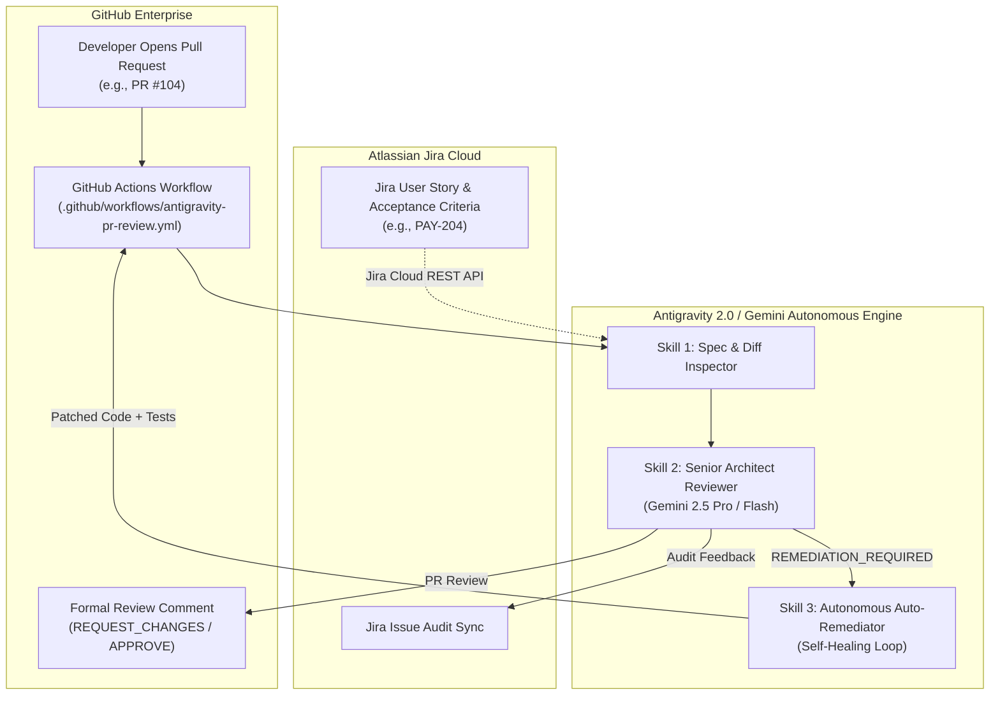

# 🏢 Enterprise Deployment Guide: Autonomous SDLC Code Review & Self-Healing CI/CD

This guide provides step-by-step instructions for deploying the **Autonomous SDLC Code Review & Self-Healing Remediation Agent** into your organization's production GitHub and Atlassian Jira environments.

---

## 🏗️ Architecture Overview



---

## 📋 Step 1: Configure Credentials & Secrets

### 1.1 GitHub Personal Access Token (PAT)
1. In GitHub, navigate to **Settings > Developer Settings > Personal Access Tokens > Fine-grained tokens** (or Classic Tokens).
2. Generate a token with the following repository permissions:
   - **Pull requests:** `Read and write` (to fetch diffs and submit review comments)
   - **Contents:** `Read and write` (for auto-remediation commits and branch pushes)
   - **Issues:** `Read and write`
3. Save as secret `REPO_ACCESS_TOKEN` or `GITHUB_TOKEN`.

### 1.2 Atlassian Jira API Token
1. Log in to [Atlassian Account Security](https://id.atlassian.com/manage-profile/security/api-tokens).
2. Click **Create API token** and assign a label (e.g. `antigravity-2.0-sdlc-reviewer`).
3. Note your:
   - `ATLASSIAN_HOST` (e.g. `https://your-company.atlassian.net`)
   - `ATLASSIAN_EMAIL` (e.g. `service-account@your-company.com`)
   - `ATLASSIAN_API_TOKEN`

### 1.3 Google Gemini / Vertex AI API Key
1. Obtain an API key from [Google AI Studio](https://aistudio.google.com/) or configure a Google Cloud Service Account with **Vertex AI User** role.
2. Note your `GEMINI_API_KEY` or `GCP_PROJECT`.

---

## 🚀 Step 2: Deploy to GitHub Actions (Turnkey CI/CD)

1. In your target repository, copy the workflow file into `.github/workflows/antigravity-pr-review.yml`:
   ```bash
   cp .github/workflows/antigravity-pr-review.yml /path/to/your-repo/.github/workflows/
   ```

2. Configure Repository Secrets:
   - Go to your repository **Settings > Secrets and variables > Actions**.
   - Add the following secrets:
     - `REPO_ACCESS_TOKEN`
     - `ATLASSIAN_HOST`
     - `ATLASSIAN_EMAIL`
     - `ATLASSIAN_API_TOKEN`
     - `GEMINI_API_KEY`
     - `GCP_PROJECT`

3. When any developer opens or updates a Pull Request referencing a Jira ticket in the title or description (e.g., `[PAY-204]`), the workflow will automatically execute the live review!

---

## 💻 Step 3: Local / CLI & Docker Execution

For local testing or custom runner deployment:

1. Copy the template environment file:
   ```bash
   cp .env.example .env
   ```
2. Fill in your real API credentials in `.env`.
3. Run the automated review for any PR:
   ```bash
   # Review live PR #104 against Jira
   python3 orchestrate_review.py --stage review --pr 104

   # Run full autonomous remediation loop
   python3 orchestrate_review.py --stage all --pr 104
   ```
4. Start the live management dashboard:
   ```bash
   python3 orchestrate_review.py --serve --port 8085
   ```

---

## 🔒 Security & Compliance Best Practices

- **Zero Secret Exposure:** API keys and credentials are never committed; they are read strictly from environment variables and encrypted CI/CD secrets.
- **Branch Protection Rules:** You can configure GitHub Branch Protection to require the `Antigravity 2.0 Autonomous Code Review` status check to pass before merging into `main`.
- **Defensive Sandboxing:** In the absence of live API tokens, the system operates in a sandboxed, deterministic simulation mode to ensure presentations and offline evaluations never break.
