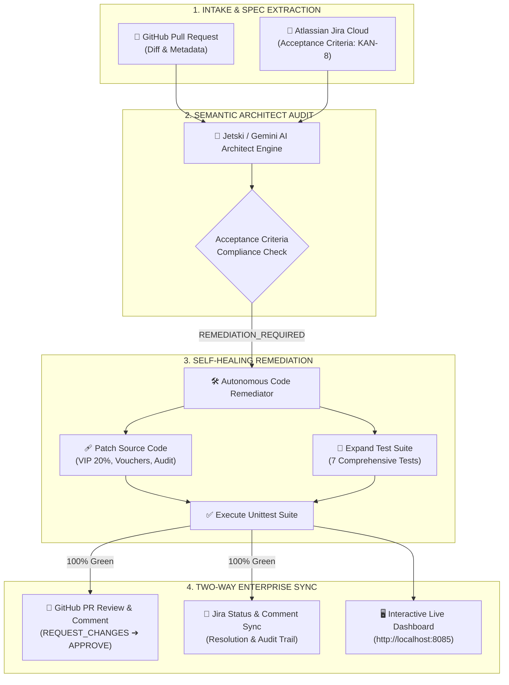

# 🤖 Autonomous SDLC Code Review & Self-Healing Remediation Agent

[](https://github.com/tuts2024/agy-demo/actions/workflows/jetski-pr-review.yml)
[](https://www.python.org/downloads/)
[](https://ntuteja.atlassian.net)
[](https://github.com/tuts2024/agy-demo)
[](#architecture)

An enterprise-grade, non-interactive autonomous agent pipeline that transforms traditional CI/CD from basic syntax linting into **semantic architecture governance and self-healing code remediation**.

---

## 🌟 Executive Summary & Problem Statement

In standard software development lifecycles (SDLC):
* **Traditional CI/CD is blind to business intent:** Linters and static test suites only check syntax and existing assertions. They cannot determine if a Pull Request satisfies the product specifications described in a product ticket.
* **Human review bottlenecks:** Senior engineers spend hours cross-referencing Pull Requests against Jira tickets, catching missed requirements, regressions, and incomplete test coverage.
* **Costly feedback loops:** When a PR fails review, it often sits in backlog queues for days awaiting developer attention.

### 💡 The Solution: Autonomous Multi-Agent Governance
This platform introduces an automated multi-agent governance loop:
1. **Intake & Context Fusion:** Automatically ingests Pull Request diffs and pulls linked Jira user stories & Acceptance Criteria in real time via live APIs.
2. **Deep Semantic Architect Review:** Audits code line-by-line against product requirements, security best practices, and edge cases.
3. **Autonomous Self-Healing Remediation:** When criteria diverge, an autonomous remediation agent generates targeted code patches, expands test suites, and verifies 100% passing tests before merge approval.

---

## 🏛️ System Architecture



---

## 🚀 Key Capabilities

* 🎯 **Live Multi-System Integration:** Connects seamlessly to GitHub REST API, Atlassian Jira Cloud REST API (v3 with ADF parsing), and Google Cloud Gemini / Vertex AI.
* ⚖️ **Acceptance Criteria Verification Matrix:** Cross-references every PR line against individual Jira Acceptance Criteria (e.g. `AC-1`, `AC-2`, `AC-3`, `AC-4`).
* 🩹 **Zero-Touch Self-Healing:** Autonomously patches buggy business logic, repairs faulty assertions, and adds defensive edge-case handling.
* 🧪 **Automated Test Expansion:** Expands legacy tests into comprehensive suites covering positive, negative, boundary, and inactive state test cases.
* 🖥️ **Real-Time Interactive Dashboard:** Web-based executive control center featuring live pipeline steppers, side-by-side diff viewers, and log streaming.
* 🔒 **Dual-Mode Sandbox & Live Execution:** Operates out-of-the-box with deterministic built-in fixtures or connects to live enterprise SaaS instances.

---

## 📂 Repository Structure

```
.
├── .github/workflows/
│   └── jetski-pr-review.yml     # GitHub Actions workflow definition
├── src/
│   ├── models.py                # Core domain entities (Customer, Tier, Voucher)
│   ├── discount_service.py      # Checkout discount & pricing calculation engine
│   └── integrations/
│       ├── github_client.py     # GitHub REST API client & 422 fallback handler
│       ├── jira_client.py       # Jira Cloud API client (ADF parser & unassigned safe)
│       └── gemini_engine.py     # Google Vertex AI / Gemini API engine
├── tests/
│   └── test_discount_service.py # Comprehensive unit test suite (7 test cases)
├── jira/
│   └── KAN-8-ticket.json        # Jira specification fixture (4 Acceptance Criteria)
├── reports/
│   ├── state.json               # Real-time orchestration state for web dashboard
│   ├── review-report-PR1.md     # Markdown architect review report
│   └── remediation-log-PR1.md   # Markdown autonomous remediation log
├── orchestrate_review.py        # Central orchestrator CLI & HTTP backend server
├── sdlc-review-dashboard.html   # Modern dark-mode web dashboard UI
├── run_demo.sh                  # One-command demo dashboard launcher
├── demo-cli-prompt.sh           # CLI emulation runner script
├── DEMO_GUIDE.md                # Presenter's script & stage-by-stage demo guide
└── README.md                    # Project documentation
```

---

## ⚡ Quick Start (Local Demo)

### 1. Prerequisites
* Python 3.10+
* Git
* Modern Web Browser (Chrome, Firefox, Safari, Edge)

### 2. Launch the Interactive Dashboard
Run the launcher script in your terminal:
```bash
./run_demo.sh
```

Open your browser to **[http://localhost:8085/](http://localhost:8085/)**.

---

## 🎮 How to Demo (Interactive Walkthrough)

### Step 1: Inspect Pre-Review State
* View the **GitHub Pull Request** card (`#1` by `@ntuteja`) and **Jira User Story** card (`KAN-8`).
* Observe that the **Acceptance Criteria Matrix** shows all 4 criteria in `PENDING` status.

### Step 2: Run Architect Review
Click the blue **"Run Architect Review"** button (or run `python3 orchestrate_review.py --stage review`).
* The pipeline stepper lights up stages 1 through 4.
* Status flips to **`REMEDIATION REQUIRED`**.
* The AC Matrix flags 4 critical failures:
  1. **AC-1 (Rate Regression):** VIP Platinum multiplier set to `0.10` (10%) instead of `0.20` (20%).
  2. **AC-2 (Missing Defenses):** Vouchers missing `is_active` validation and discount cap checks.
  3. **AC-3 (Misleading Tests):** Unit tests asserting obsolete $90 outcome, masking the bug.
  4. **AC-4 (Compliance Gap):** Missing structured audit trail logging.

### Step 3: Trigger Autonomous Remediation
Click the green **"Autonomous Remediate"** button (or run `python3 orchestrate_review.py --stage remediate`).
* The agent applies targeted code patches to `src/discount_service.py`.
* Expands `tests/test_discount_service.py` to **7 comprehensive unit tests**.
* Runs `unittest` and confirms **100% tests passing**.
* Status badge turns emerald: **`VERIFIED & APPROVED`**.
* Switch to the **"Code Diff & Patches"** tab to view the side-by-side code diff.

---

## ⚙️ Enterprise Cloud Setup (GitHub Actions & Jira)

To enable live execution directly on your GitHub repository:

### 1. Environment Configuration (`.env`)
Create or edit `.env` in the root folder:
```bash
# 1. Google Cloud Vertex AI (Optional)
GCP_PROJECT="your-gcp-project"
GCP_LOCATION="us-central1"
VERTEX_AI_MODEL="gemini-2.5-flash"

# 2. GitHub API Integration
GITHUB_TOKEN="your_github_pat_token"
GITHUB_REPOSITORY="tuts2024/agy-demo"

# 3. Atlassian Jira Cloud Integration
ATLASSIAN_HOST="https://your-domain.atlassian.net"
ATLASSIAN_EMAIL="your-email@example.com"
ATLASSIAN_API_TOKEN="your_jira_api_token"
JIRA_PROJECT_KEY="KAN"
```

### 2. GitHub Repository Secrets
In your GitHub repository under **Settings ➔ Secrets and variables ➔ Actions**, configure:

| Secret Name | Value Example |
| :--- | :--- |
| `ATLASSIAN_HOST` | `https://your-domain.atlassian.net` |
| `ATLASSIAN_EMAIL` | `your-email@example.com` |
| `ATLASSIAN_API_TOKEN` | `ATATT3xFfGF0...` *(Jira Cloud API Token)* |

---

## 🛠️ CLI Quick Reference

```bash
# Start Web Dashboard & Server
./run_demo.sh

# Run Full Review & Remediation CLI
./demo-cli-prompt.sh

# Execute only Stage 1 & 2 (Architect Review)
python3 orchestrate_review.py --stage review --pr 1

# Execute only Stage 3 (Autonomous Remediation)
python3 orchestrate_review.py --stage remediate --pr 1

# Reset repository to initial buggy state
python3 orchestrate_review.py --reset

# Run Unit Test Suite
python3 -m unittest discover tests -v
```

---

## 📄 License
This project is licensed under the Apache 2.0 License.
